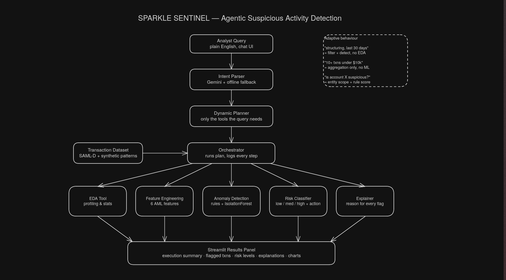

# ✦ Sparkle Sentinel

An agentic AI system for suspicious activity detection in banking transactions.
Type a plain-English question — the agent parses your intent, builds a dynamic
execution plan, invokes **only the tools that query needs**, and returns flagged
transactions with risk levels, evidence-based explanations, and a recommended
escalation action.

Built for Campus Hackathon 2026 by **Team Sparkle**.



## Why agentic

The agent is not a fixed pipeline — every query produces a different execution plan:

| Query | What the agent does |
|---|---|
| "Find structuring patterns in the last 30 days" | time filter → structuring-focused features → hybrid detection · full EDA **skipped** |
| "Which customers made 10+ transactions under $10,000?" | aggregation + threshold rule only · **no ML invoked** |
| "Is account 9285172899 suspicious?" | scopes to that account → rule-based scoring on demand |
| "Analyse this dataset for suspicious activity" | full chain: EDA → features → hybrid detection → risk → explanations |

The numbers in queries are parsed, not hardcoded — "15+ transactions under
$5,000" works the same way.

## How detection works

- **Feature engineering** — six behavioural features per transaction: frequency,
  48h rolling amount sum, per-sender amount z-score, velocity, near-threshold
  flag, near-threshold count (repetition just under the 10k reporting threshold —
  the classic structuring signature), cross-border flag.
- **Hybrid anomaly detection** — a transparent rule engine (configurable
  thresholds, adaptive cross-border weighting) blended 50/50 with an
  IsolationForest trained on the same features.
- **Risk classification** — score bands → Low / Medium / High, with a high-risk
  country override, mapped to escalation actions: monitor / flag for review / report.
- **Explanations** — each flag's actual feature evidence is narrated into one
  plain-English sentence.

The LLM never decides what is suspicious. Scoring is deterministic and
auditable; Gemini only parses queries on the way in and narrates evidence on the
way out. If no API key is available (or quota runs out), an offline parser and
template explanations keep the agent fully functional.

## Results

On the real SAML-D dataset the agent surfaces accounts with 11–13 near-threshold
transactions as structuring candidates, and flags ground-truth laundering
accounts (e.g. `9285172899`) as High risk **without ever reading the
`Is_laundering` label**. On the synthetic evaluation set with planted patterns,
all 6 structuring rings are caught (see `scripts/smoke_test.py`).

## Datasets

1. **SAML-D** (primary, real public dataset) — Synthetic Transaction Monitoring
   Dataset for AML, 9.5M transactions, 28 typologies.
   Source: <https://www.kaggle.com/datasets/berkanoztas/synthetic-transaction-monitoring-dataset-aml>
   (B. Oztas et al., *"Enhancing Anti-Money Laundering: Development of a Synthetic
   Transaction Monitoring Dataset"*, IEEE ICEBE 2023.)
   Download from Kaggle and place at `data/SAML-D.csv`, then build the demo
   sample: `python scripts/make_sample.py` (account-preserving 500k-row sample —
   random row-sampling would destroy per-account patterns).
   A pre-built sample is included at `data/SAML-D-sample.csv`.
2. **Synthetic evaluation set** (generated, labelled) — `scripts/generate_synthetic.py`
   creates `data/synthetic_eval.csv` in SAML-D schema: ~20k baseline transactions
   (log-normal amounts, mostly domestic) plus injected patterns with ground-truth
   labels — 6 structuring rings (repeated 9.1–9.9k cash deposits), 4 smurfing
   clusters (many small senders → one aggregator → cross-border out), 4 rapid-
   movement bursts. Labels (`Is_laundering`, `Laundering_type`) are used **only**
   for evaluation, never by the detector. All assumptions and generation logic
   are in the script.

## Run it

```bash
pip install -r requirements.txt
cp .env.example .env          # add your GEMINI_API_KEY (optional — offline mode works without it)

# dashboard (FastAPI + custom UI)
python api/server.py          # → http://localhost:8600

# or the Streamlit app
streamlit run app/streamlit_app.py

# end-to-end test on the synthetic evaluation set
python scripts/smoke_test.py
```

## Tech stack

Python · pandas · scikit-learn (IsolationForest) · FastAPI · vanilla-JS dashboard ·
Streamlit · Plotly · Gemini API (`gemini-3.5-flash-lite`, free tier) with full
offline fallback.

## Repo map

```
api/server.py            FastAPI JSON API + dashboard hosting
static/                  dashboard frontend (no build step)
app/streamlit_app.py     alternative Streamlit UI
src/agent/               intent parser (Gemini + offline), planner, orchestrator
src/tools/               EDA, feature engineering, anomaly detection,
                         risk classification, explanation
scripts/                 synthetic generator · sampler · smoke test
```

## AI assistance disclosure

Per hackathon rules: development was assisted by **Claude Code** (Anthropic) for
scaffolding, debugging, and the dashboard frontend, and by **Google Gemini** (in
Google AI Studio) during prototyping. The Gemini API (`gemini-3.5-flash-lite`)
is used at runtime for intent parsing and explanation generation. All detection
logic, feature design, and validation were reviewed, tuned, and tested by the team.

## Team

Team Sparkle — 2 members.
