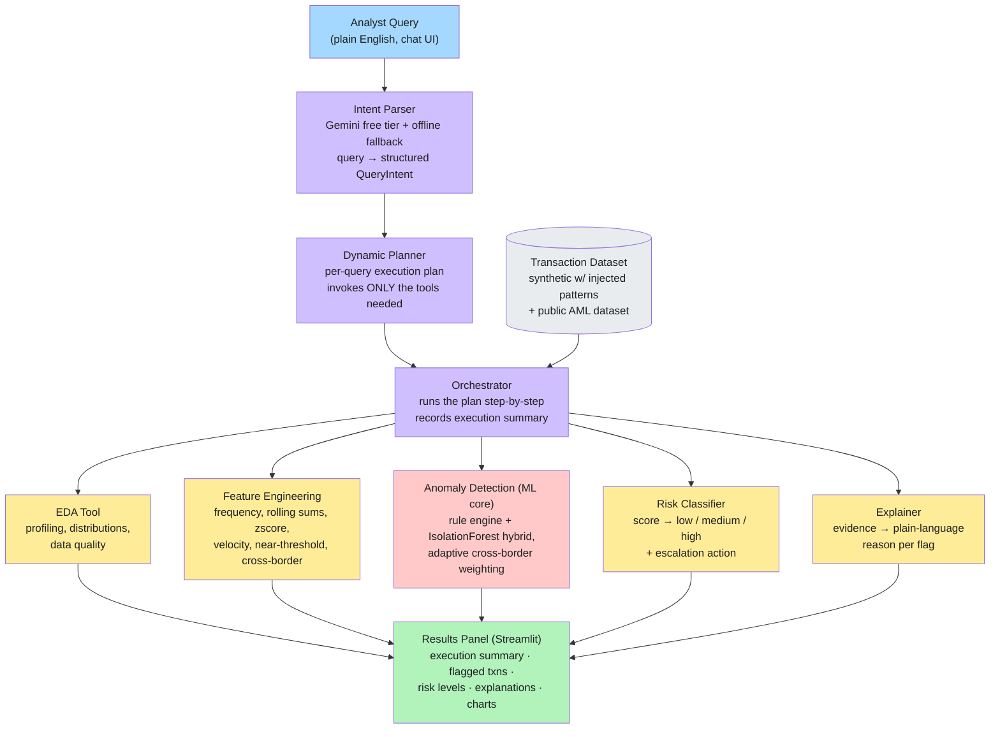

```mermaid
flowchart TB
    Q["Analyst Query<br/>(plain English, chat UI)"]
    P["Intent Parser<br/>Gemini free tier + offline fallback<br/>query → structured QueryIntent"]
    PL["Dynamic Planner<br/>per-query execution plan<br/>invokes ONLY the tools needed"]
    O["Orchestrator<br/>runs the plan step-by-step<br/>records execution summary"]
    D[("Transaction Dataset<br/>synthetic w/ injected patterns<br/>+ public AML dataset")]

    T1["EDA Tool<br/>profiling, distributions,<br/>data quality"]
    T2["Feature Engineering<br/>frequency, rolling sums, zscore,<br/>velocity, near-threshold, cross-border"]
    T3["Anomaly Detection (ML core)<br/>rule engine + IsolationForest hybrid,<br/>adaptive cross-border weighting"]
    T4["Risk Classifier<br/>score → low / medium / high<br/>+ escalation action"]
    T5["Explainer<br/>evidence → plain-language<br/>reason per flag"]

    R["Results Panel (Streamlit)<br/>execution summary · flagged txns ·<br/>risk levels · explanations · charts"]

    Q --> P --> PL --> O
    D --> O
    O --> T1 & T2 & T3 & T4 & T5
    T1 & T2 & T3 & T4 & T5 --> R

    style Q fill:#a5d8ff,color:#1e1e1e
    style P fill:#d0bfff,color:#1e1e1e
    style PL fill:#d0bfff,color:#1e1e1e
    style O fill:#d0bfff,color:#1e1e1e
    style T3 fill:#ffc9c9,color:#1e1e1e
    style T1 fill:#ffec99,color:#1e1e1e
    style T2 fill:#ffec99,color:#1e1e1e
    style T4 fill:#ffec99,color:#1e1e1e
    style T5 fill:#ffec99,color:#1e1e1e
    style R fill:#b2f2bb,color:#1e1e1e
    style D fill:#e9ecef,color:#1e1e1e
```
